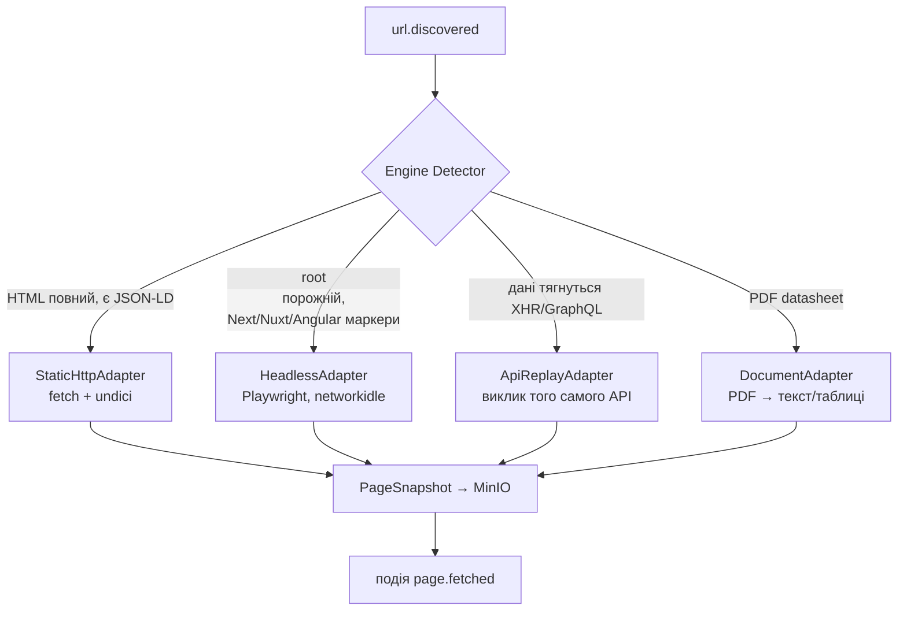
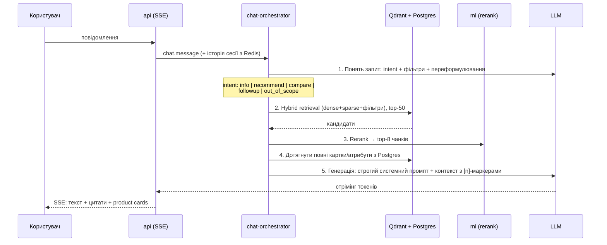

# Вікіпедія Товарів — Архітектура

> Некомерційний, соціально корисний сервіс: достовірна інформація про товари, рекомендації за потребами, порівняння товарів через AI-чат з RAG-пошуком. Єдине джерело правди — **офіційні сайти виробників**.

---

## 1. Принципи та обмеження

| Принцип | Наслідок для архітектури |
|---|---|
| **Довіряємо лише виробникам** | Whitelist-реєстр доменів; кожен факт має provenance (URL + дата + версія сторінки); жодних маркетплейсів/агрегаторів |
| **Не вводимо в оману** | Чат відповідає лише з retrieved-контексту, кожне твердження — з цитатою на джерело; «не знаю» замість вигадування |
| **Масштабність** | Подієва (event-driven) архітектура, горизонтально масштабовані stateless-воркери, черги як backbone |
| **Некомерційність** | Open-source стек, self-hosted компоненти, локальні embedding-моделі як default (LLM API — опційно) |
| **Різні рушії сайтів** | Fetch-шар — плагінна система адаптерів (static HTML / SPA / API / sitemap) з автодетекцією рушія |
| **Еволюція даних** | Immutable raw-снапшоти + версіоновані canonical-сутності; будь-який етап пайплайна можна переграти (replay) |

---

## 2. Загальна схема

```mermaid
flowchart LR
    subgraph Acquisition["1. Здобуття даних"]
        REG[Source Registry\nреєстр виробників] --> SCHED[Scheduler]
        SCHED --> DISC[Discovery\nsitemap/crawl]
        DISC --> FETCH[Fetcher\nадаптери рушіїв]
        FETCH --> RAW[(Object Storage\nraw snapshots)]
    end

    subgraph Processing["2. Обробка"]
        EXTR[Extractor\nJSON-LD → евристики → LLM] --> NORM[Normalizer\nодиниці, атрибути]
        NORM --> RESOL[Entity Resolution\nдедуплікація]
        RESOL --> CANON[(PostgreSQL\ncanonical products)]
    end

    subgraph Indexing["3. Індексація"]
        DOCB[Doc Builder\nчанкінг] --> EMB[Embedder]
        EMB --> VDB[(Qdrant\ndense + sparse)]
        DOCB --> FTS[(Full-text / BM25)]
    end

    subgraph Chat["4. AI-чат"]
        GW[API Gateway] --> ORCH[Chat Orchestrator]
        ORCH --> RETR[Hybrid Retrieval + Rerank]
        RETR --> VDB
        RETR --> CANON
        ORCH --> LLM[LLM\nвідповідь з цитатами]
    end

    RAW -. подія: page.fetched .-> EXTR
    CANON -. подія: product.updated .-> DOCB

    BUS{{NATS JetStream\nevent bus}}
    Acquisition --- BUS --- Processing
    BUS --- Indexing
```

Чотири підсистеми зв'язані **лише через шину подій** (NATS JetStream) та сховища. Кожну можна розробляти, деплоїти й масштабувати незалежно.

---

## 3. Технологічний стек

| Шар | Вибір | Чому |
|---|---|---|
| Монорепо | **pnpm workspaces + Turborepo** | Кеш збірок, спільні пакети типів front/back |
| Мова | **TypeScript** всюди (+ Python лише для ML-сервісу embedding/rerank) | Одна модель типів від скрейпера до фронта |
| Фронтенд | **Next.js (App Router) + React** | SSR для SEO сторінок товарів, streaming UI для чату |
| API | **Fastify + tRPC** (внутрішнє) + REST (публічне) + **SSE** для стрімінгу чату | Type-safety end-to-end у монорепо |
| Шина подій | **NATS JetStream** | Легша за Kafka в експлуатації, persistence, consumer groups, replay; достатньо для мільйонів подій/день |
| Основна БД | **PostgreSQL 16** | Canonical-модель, JSONB для атрибутів, transactional outbox |
| Векторна БД | **Qdrant** | Named vectors (dense+sparse), payload-фільтри, горизонтальний шардинг |
| Full-text | **Postgres FTS** на старті → OpenSearch при зростанні | Менше рухомих частин на MVP |
| Object storage | **MinIO (S3 API)** | Immutable raw HTML/скріншоти/PDF |
| Кеш / rate-limit | **Redis** | Сесії чату, кеш retrieval, distributed locks краулера |
| Скрейпінг | **Crawlee** (+ Playwright для SPA) | Готові механізми черг, proxy, fingerprint, autoscaling |
| Embeddings | **BGE-M3** (self-hosted, мультимовна: укр/англ, dense+sparse одночасно) | Некомерційність, без vendor lock-in |
| Reranker | **bge-reranker-v2-m3** | Той самий стек, крос-мовний |
| LLM чату | Абстракція `LLMProvider`: локальна (vLLM + Llama/Qwen) або API (Claude) | Конфігурується, не зашито |
| Оркестрація | **Docker Compose (dev) → Kubernetes + KEDA** | Автоскейл воркерів за глибиною черги |
| Observability | OpenTelemetry + Prometheus + Grafana + Loki | Трейс від події fetch до відповіді чату |

---

## 4. Структура монорепо

```
product-wiki/
├── apps/
│   ├── web/                    # Next.js: чат, картки товарів, порівняння
│   └── api/                    # Fastify: публічне REST + tRPC + SSE, auth, rate-limit
├── services/                   # stateless-воркери, споживачі подій
│   ├── scheduler/              # планування обходів, пріоритети, recrawl-політики
│   ├── discovery/              # sitemap/crawl: знаходить URL сторінок товарів
│   ├── fetcher/                # завантаження сторінок (адаптери рушіїв)
│   ├── extractor/              # HTML → структурований ProductDraft
│   ├── normalizer/             # одиниці, онтологія атрибутів, таксономія
│   ├── resolver/               # entity resolution, дедуплікація, версіонування
│   ├── indexer/                # doc builder → embeddings → Qdrant/FTS
│   ├── ml/                     # Python: embedding + rerank inference (gRPC)
│   └── chat-orchestrator/      # RAG-пайплайн чату
├── packages/
│   ├── contracts/              # zod-схеми подій, сутностей, API DTO — єдине джерело типів
│   ├── db/                     # Drizzle ORM: схема Postgres, міграції
│   ├── events/                 # клієнт NATS: typed publish/subscribe, outbox
│   ├── engine-adapters/        # плагіни fetch-рушіїв + детектор
│   ├── taxonomy/               # категорії товарів + онтологія атрибутів
│   ├── llm/                    # абстракція LLMProvider, промпти, guardrails
│   └── config/                 # eslint, tsconfig, спільні конфіги
├── infra/
│   ├── docker/                 # compose для dev (postgres, nats, qdrant, minio, redis)
│   ├── k8s/                    # helm-чарти, KEDA ScaledObjects
│   └── grafana/                # дашборди, алерти
└── turbo.json / pnpm-workspace.yaml
```

Ключова ідея: **`packages/contracts` — центр всесвіту.** Усі події, сутності та DTO описані zod-схемами; воркери валідують вхід/вихід на межах, фронт отримує ті самі типи через tRPC.

---

## 5. Підсистема здобуття даних

### 5.1. Source Registry — реєстр довірених джерел

Довіра — головна цінність продукту, тому джерела не «додаються скрейпером», а **курируються**:

```typescript
interface ManufacturerSource {
  id: string;
  name: string;                    // "Bosch"
  domains: string[];               // ["bosch.com", "bosch.ua"] — верифіковані
  verification: {
    method: 'manual' | 'dns' | 'wikidata';   // як підтвердили, що домен офіційний
    verifiedBy: string;
    verifiedAt: Date;
  };
  crawlPolicy: {
    entrypoints: string[];         // sitemap URL або каталожні розділи
    urlPatterns: RegExp[];         // які URL вважати сторінками товарів
    engineHint?: EngineType;       // якщо відомий заздалегідь
    maxRps: number;                // ввічливість, default 0.5 rps
    recrawlIntervalDays: number;   // 30 для специфікацій, рідше для legacy
  };
  status: 'active' | 'paused' | 'blocked_by_robots';
}
```

- Первинне наповнення: Wikidata (`P856` — official website) + ручна модерація.
- `robots.txt` — **жорстке правило**: заборона → джерело `blocked_by_robots`, крапка. Ми соціальний проєкт і поводимось зразково.

### 5.2. Discovery — пошук сторінок товарів

Пріоритет способів (від дешевого до дорогого):

1. **Sitemap** (`sitemap.xml`, sitemap index) — покриває ~80% виробників;
2. **Каталожний BFS-обхід** з entrypoints, з фільтром за `urlPatterns`;
3. **Класифікатор сторінки** (легка модель / евристики: наявність JSON-LD `Product`, хлібні крихти, кнопка специфікацій) — відсіює новини/кар'єрні сторінки.

Результат — подія `url.discovered { sourceId, url, priority }` у чергу fetcher-а. Redis утримує bloom-filter відвіданих URL per source.

### 5.3. Fetcher — адаптери під різні рушії

Це відповідь на вимогу «адаптуватись під різні рушії». Патерн **Strategy + автодетекція**:



```typescript
interface EngineAdapter {
  readonly type: EngineType;      // 'static' | 'headless' | 'api-replay' | 'document'
  probe(url: string, headResponse: ProbeData): Promise<number>;  // confidence 0..1
  fetch(task: FetchTask): Promise<PageSnapshot>;
}

interface PageSnapshot {          // immutable, зберігається в MinIO
  url: string; sourceId: string;
  fetchedAt: Date;
  engine: EngineType;
  contentHash: string;            // для skip незмінених сторінок
  html?: string;                  // фінальний DOM (після рендера для SPA)
  apiPayloads?: JsonCapture[];    // перехоплені XHR/GraphQL відповіді — часто чистіші за HTML
  screenshots?: string[];         // ключі в MinIO, для дебагу extraction
}
```

Правила роботи:

- **Детекція кешується** per-source: визначили рушій один раз — далі без probe. Виробники рідко міняють стек.
- `HeadlessAdapter` — найдорожчий (браузерний пул), тому детектор завжди спершу пробує static; KEDA скейлить headless-пул окремо.
- **Ввічливість**: token-bucket per domain у Redis, User-Agent з посиланням на сторінку проєкту та контактом, exponential backoff на 429/5xx.
- **Anti-fragility**: `contentHash` збігся з попереднім снапшотом → пайплайн далі не запускається (економія 70–90% обробки на recrawl).
- Новий «дивний» рушій = новий пакет-плагін у `packages/engine-adapters`, без змін ядра.

### 5.4. Scheduler

- Cron-подібні recrawl-хвилі за `recrawlIntervalDays` + пріоритетні позачергові задачі (нове джерело, скарга користувача на застарілі дані).
- Пріоритетна черга: нові товари > популярні товари (за запитами чату!) > хвостові recrawl. Зворотний зв'язок від чату — метрика попиту.

---

## 6. Підсистема обробки контенту

### 6.1. Extractor — каскад від детермінованого до LLM

Головне правило: **LLM — останній рубіж, а не перший**. Дешевше, детермінованіше, менше галюцинацій:

```
1. Structured data:  JSON-LD schema.org/Product → Microdata → OpenGraph   (~60% сайтів)
2. API payloads:     якщо ApiReplayAdapter зловив JSON — беремо його        (найчистіші дані)
3. Site recipes:     збережені CSS/XPath-селектори per source              (написані один раз, або згенеровані LLM і закешовані)
4. LLM extraction:   HTML → readability-очистка → LLM зі строгою zod-схемою виходу
                     + self-check: кожне витягнуте значення має бути substring/парафразом сторінки
```

Рівні 1–3 покривають більшість; рівень 4 вмикається для нових/складних сайтів, а його результат для стабільних шаблонів **конвертується в recipe рівня 3** (LLM пише селектори, ми їх верифікуємо на 5–10 сторінках і кешуємо).

Вихід — `ProductDraft`:

```typescript
interface ProductDraft {
  snapshotRef: string;                       // provenance: звідки взято
  name: string;
  brand: string;
  mpn?: string; gtin?: string;               // ключі для entity resolution
  categoryRaw: string[];                     // хлібні крихти сайту
  attributesRaw: { key: string; value: string; unit?: string }[];
  descriptions: { section: string; text: string }[];
  media: { type: 'image' | 'manual_pdf'; url: string }[];
  extractionMethod: 'jsonld' | 'api' | 'recipe' | 'llm';
  confidence: number;
}
```

### 6.2. Normalizer — спільна мова атрибутів

Без цього порівняння товарів неможливе:

- **Одиниці**: `"2,5 кг" / "2500 g" / "5.5 lbs"` → canonical SI + оригінал збережено;
- **Онтологія атрибутів** (`packages/taxonomy`): mapping `"вага" / "weight" / "net weight"` → `attr:weight_net`. Ведеться як версіонований YAML + автопропозиції нових мапінгів від LLM у чергу модерації;
- **Таксономія категорій**: власне дерево на базі GS1 GPC; категоризація — класифікатор за назвою/крихтами/атрибутами;
- **Мови**: зберігаємо оригінал + переклад ключових полів (BGE-M3 крос-мовний, тому вектори працюють і без перекладу).

### 6.3. Resolver — entity resolution та версіонування

Один товар живе на `bosch.com`, `bosch.ua`, у PDF-datasheet — треба злити в одну canonical-сутність:

1. **Точний матч**: GTIN → MPN+brand (покриває більшість);
2. **Fuzzy**: blocking за brand+category, далі схожість назви (embedding cosine) + збіг ключових атрибутів; поріг нижче auto-merge → черга ручної модерації;
3. **Конфлікти значень** (укр. сайт каже 2.4 кг, глобальний — 2.5 кг): зберігаємо обидва з provenance, canonical — за пріоритетом джерела (регіональний офіційний > глобальний > datasheet), конфлікт видимий у UI («дані відрізняються між регіональними сайтами»);
4. **Версіонування**: кожна зміна canonical-продукту → новий `revision` (append-only). Чат завжди може відповісти «станом на дату X».

### 6.4. Модель даних (Postgres, ядро)

```
sources                (реєстр виробників)
crawl_tasks            (стан задач fetch)
page_snapshots         (метадані; тіло — в MinIO)
product_drafts         (сирі екстракти, FK → snapshot)
products               (canonical: id, brand, name, category_id, status)
product_revisions      (append-only версії canonical)
product_attributes     (attr_key, value_canonical, value_raw, unit, source_snapshot_id)  ← provenance на рівні атрибута
product_texts          (описи/розділи, source_snapshot_id)
categories / attribute_ontology
merge_queue            (кандидати на злиття, ручна модерація)
outbox                 (transactional outbox → NATS)
```

**Transactional outbox** — обов'язково: запис у БД і публікація події атомарні, relay-процес доставляє у NATS. Жодних «записали в базу, а подію загубили».

### 6.5. Потік подій

| Подія | Producer → Consumer | Семантика |
|---|---|---|
| `source.registered` | api → scheduler | нове джерело, запустити discovery |
| `url.discovered` | discovery → fetcher | чергa на завантаження |
| `page.fetched` | fetcher → extractor | снапшот у MinIO готовий |
| `page.unchanged` | fetcher → scheduler | hash збігся, лише оновити last_seen |
| `draft.extracted` | extractor → normalizer | є ProductDraft |
| `draft.normalized` | normalizer → resolver | атрибути канонізовані |
| `product.updated` | resolver → indexer | canonical змінився (нова revision) |
| `product.indexed` | indexer → (метрики) | вектори/FTS оновлені |
| `extraction.failed` | будь-хто → DLQ + алерт | у dead-letter з повним контекстом |

Усі консюмери **ідемпотентні** (ключ ідемпотентності = `snapshotRef`/`revisionId`), бо JetStream дає at-least-once. Retry з backoff ×3 → DLQ → Grafana-алерт.

---

## 7. Векторизація та індексація

### 7.1. Doc Builder — чанкінг, що поважає структуру товару

Товар — не суцільний текст, тому не «нарізаємо по 512 токенів», а будуємо **типізовані чанки**:

| Тип чанка | Вміст | Навіщо |
|---|---|---|
| `overview` | назва + бренд + категорія + стислий опис | запити «що це / розкажи про X» |
| `spec_group` | група атрибутів (живлення, габарити, звук…) серіалізована в речення: «Вага нетто: 2.5 кг. Потужність: 1400 Вт.» | запити про характеристики |
| `feature` | окремий маркетинговий/функціональний розділ опису | запити «чи вміє X робити Y» |
| `usecase` | згенерований LLM один раз при індексації: «для кого і яких потреб цей товар» (з фактів картки, з self-check) | **рекомендаційні** запити «порадь для…» — головний міст між мовою потреб і мовою специфікацій |

Кожен чанк несе payload: `productId, brand, categoryPath, chunkType, attrs{price_class, weight...}, revisionId, sourceUrls[]`.

### 7.2. Embedding та індекси

- **BGE-M3** видає dense + sparse (lexical) вектори за один прохід → у Qdrant як named vectors однієї точки;
- Гібридний пошук = dense (семантика, крос-мовність) + sparse (точні моделі/артикули типу «WAU28T90») + payload-фільтри (категорія, бренд, діапазони атрибутів);
- Окремо: Postgres FTS по назвах/MPN для «точного» пошуку і автокомпліту;
- **Реіндексація**: подія `product.updated` → indexer перебудовує лише чанки цього товару (upsert за `productId+chunkType+ordinal`, старі — delete за фільтром `revisionId <`). Зміна embedding-моделі → нова колекція + blue/green перемикання alias-ом.

Python ML-сервіс (`services/ml`) тримає моделі в пам'яті, віддає gRPC `embed(texts[])` та `rerank(query, docs[])`; скейлиться окремо (GPU-ноди), батчить запити.

---

## 8. AI-чат (RAG Orchestrator)

### 8.1. Пайплайн запиту



### 8.2. Маршрутизація за intent

- **`info`** («яка вага X?») — retrieval з фільтром по конкретному товару, відповідь з атрибутів canonical (не з тексту!) де можливо — це виключає галюцинації в цифрах;
- **`recommend`** («порадь тихий пилосос для квартири з котом до N грн») — LLM спершу перекладає потреби у структуровані критерії `{category, attr-констрейнти, soft-переваги}` → payload-фільтри + семантичний пошук по `usecase`-чанках → кандидати → LLM пояснює вибір, посилаючись на факти;
- **`compare`** («порівняй A і B») — резолвимо обидва товари → **детермінований** diff canonical-атрибутів через онтологію (спільна таблиця відмінностей будується кодом, не LLM) → LLM лише коментує значущі відмінності. Таблиця порівняння на фронті — з structured-даних, тому завжди точна;
- **`followup`** — переписування запиту з урахуванням історії (coreference: «а другий важчий?»);
- **`out_of_scope`** — чесна відмова + що сервіс уміє.

### 8.3. Guardrails достовірності

1. Системний промпт: відповідати **лише** з наданого контексту; бракує даних → сказати прямо;
2. Кожен фактичний фрагмент відповіді маркується `[n]` → фронт рендерить клікабельні цитати на сторінку виробника (той самий `sourceUrl` з provenance);
3. Числа/характеристики підставляються з canonical-атрибутів structured-шляхом, де intent це дозволяє;
4. Post-check (async, семпл): NLI-перевірка «чи випливає відповідь з контексту» → метрика faithfulness у Grafana, деградація → алерт;
5. Дисклеймер свіжості: «дані з сайту виробника станом на {snapshot date}».

### 8.4. Стан чату

- Сесії в Redis (TTL), довга історія стискається LLM-summary;
- SSE-стрім (простіше за WS, працює через будь-які проксі); события: `token`, `citation`, `product_card`, `done`;
- Rate-limit на IP/сесію — сервіс безкоштовний, захист від зловживань обов'язковий.

---

## 9. Фронтенд (apps/web)

- **Чат** — головний інтерфейс: стрімінг, вбудовані картки товарів, кнопка «порівняти» на кількох картках, цитати-джерела;
- **Сторінки товарів** (SSR, індексуються пошуковиками — це і є «вікіпедія»): характеристики з provenance-позначками, історія ревізій, кнопка «запитати чат про цей товар»;
- **Порівняння** — таблиця з canonical-атрибутів, підсвітка відмінностей, «пояснити відмінності» → чат;
- **Модераторський розділ** — merge queue, пропозиції онтології, стан джерел (окремий route group, RBAC).

---

## 10. Масштабування та експлуатація

| Вузьке місце | Рішення |
|---|---|
| Headless-рендеринг | окремий пул fetcher-headless, KEDA-скейл за глибиною NATS-стріму, ліміт браузерів/под |
| Embedding inference | GPU-ноди для `ml`, батчинг, скейл за чергою indexer-а |
| Пік запитів чату | stateless orchestrator, кеш retrieval-результатів популярних запитів (Redis, ключ = normalized query + фільтри) |
| Qdrant | шардинг за категорією при > ~50M чанків; репліки на читання |
| Postgres | read-replicas для API; snapshots/drafts — партиціювання за датою |
| Вибух вартості recrawl | contentHash-skip + пріоритезація за реальним попитом чату |

- **Спостережуваність**: trace-id народжується в `url.discovered` і живе до `product.indexed` — видно шлях кожної сторінки; для чату — trace від повідомлення до відповіді з latency кожного етапу (retrieval/rerank/LLM);
- **Якість як метрика**: дашборди coverage (товарів/джерело), extraction confidence, staleness (вік снапшотів), faithfulness чату, доля запитів «не знайдено» (= куди розширювати каталог);
- **Replay**: будь-який етап можна переграти з immutable-снапшотів (покращили extractor → переганяємо всі снапшоти категорії без recrawl).

---

## 11. Етика та легальність (критично для довіри)

- `robots.txt` та ToS — дотримуємось беззастережно; rate ≤ 0.5 rps/домен; чесний User-Agent з контактом;
- Зберігаємо факти (характеристики не охороняються авторським правом) + короткі цитати з атрибуцією; повні маркетингові тексти не републікуємо, а посилаємось;
- Кожен факт у UI веде на першоджерело — виробник отримує трафік, а не втрачає його;
- Канал для виробників: «виправити дані / заборонити обхід» — форма + пріоритетна обробка.

---

## 12. Поетапний план

**Фаза 1 — MVP (вертикальний зріз, 1–2 категорії, ~10 виробників):**
монорепо-скелет, contracts, Postgres+NATS+Qdrant+MinIO у compose; Static+Headless адаптери; extraction JSON-LD + LLM-fallback; базова нормалізація; індексація overview+spec чанків; чат: info + recommend з цитатами.

> **Стан:** ingest-половина працює наскрізь і перевірена E2E (`pnpm smoke:ingest`):
> `source → discovery → fetcher (robots.txt) → extractor (JSON-LD) → normalizer (SI) →
> resolver → canonical product з provenance`. Юніт-тести чистої логіки (vitest).
> Лишається до повного MVP: індексація в Qdrant (потребує ML-сервісу BGE-M3),
> LLM-fallback екстракції на реальних сайтах, чат info/recommend наживо.

**Фаза 2 — Достовірність і порівняння:**
entity resolution + версіонування; онтологія атрибутів + compare-intent з детермінованим diff; merge queue UI; faithfulness-метрики; SSR-сторінки товарів.

**Фаза 3 — Масштаб:**
k8s + KEDA; ApiReplay/Document адаптери; recipe-генерація LLM-ом; попит-орієнтований scheduler; OpenSearch; шардинг Qdrant; спільнота модераторів.

---

*Документ — стартова точка. Розділи 5–8 деталізуються в ADR-и (`docs/adr/`) у міру ухвалення рішень.*
